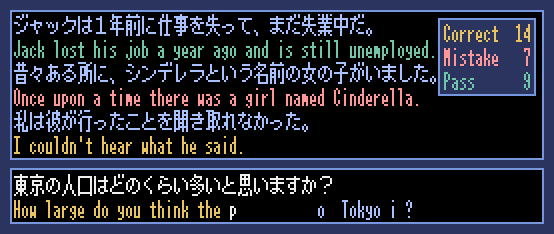

# ミニタイピング

日英翻訳タイピングゲームです。

## 操作方法

* キーボードを使って、英文を入力します。
* 入力はアルファベットのみで、数字やピリオド、ハイフンなどの入力は必要ありません。
* Enterキーでパスします。
* Tabキーで入力中の単語を表示します。

## 遊び方

* 続けて２回間違えると、ミスとなり、その単語は表示されます。
* 固有名詞とその他ランダムで、あらかじめ単語が表示されます。
* ゴールやクリアなどはありません。

## プログラム

* pyttsx3ライブラリがインストールされ、音声合成の環境が整っていれば、一行入力ごとに英文を読み上げます。
* 日本語フォントは、[8×12ドット日本語フォント「k8x12」](https://littlelimit.net/k8x12.htm)を使用しました。
